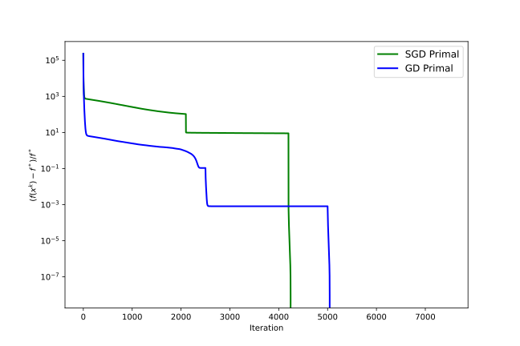

# Convex Optimization Homework #5

1700012751

麦景

----

[TOC]

## FYI

本次作业使用python完成, 并托管在[Github](https://github.com/magic3007/convex-optimization)上. 关于Python环境配置和所需安装包等, 请见[code/README.md](https://github.com/magic3007/convex-optimization/blob/main/code/README.md).

测试算例的生成代码如下, 其形式与默认随机种子与给定的matlab代码完全一致, 但是由于matlab和python在相同随机数生成器下生成正态分布的方式可能不完全相同, 因此生成的测试算例可能不同. 接下来同样会测试在其他种子下的数值表现情况.

```python
def gen_data(seed=97006855):
    n, m, l = 512, 256, 2
    mu = 1e-2
    generator = random.Generator(random.MT19937(seed=seed))
    A = generator.standard_normal(size=(m, n))
    k = round(n * 0.1)
    p = generator.permutation(n)[ :k ]
    u = np.zeros(shape=(n, l))
    u[ p, : ] = generator.standard_normal(size=(k, l))  # ground truth
    b = np.matmul(A, u)
    x0 = generator.standard_normal(size=(n, l))
    errfun = lambda x1, x2: norm(x1 - x2, 'fro') / (1 + norm(x1, 'fro'))
    errfun_exact = lambda x: norm(x - u, 'fro') / (1 + norm(x, 'fro'))
    sparsity = lambda x: np.sum(np.abs(x) > 1e-6 * np.max(np.abs(x))) / (n * l)
    return n, m, l, mu, A, b, u, x0, errfun, errfun_exact, sparsity
```

## Problem #1
> Solve (1.1) using CVX by calling different solvers `mosek` and `gurobi`.

我们在python中使用了[`cvxpy`](https://www.cvxpy.org/)来调用CVX, 并分别设置了使用`mosek`和`gurobi`来求解题目的优化问题, 相关代码分别为[gl_cvx_mosek.py](https://github.com/magic3007/convex-optimization/blob/main/code/gl_cvx_mosek.py)和[gl_cvx_gurobi.py](https://github.com/magic3007/convex-optimization/blob/main/code/gl_cvx_gurobi.py).

## Problem #2

> First write down an equivalent model of (1.1) which can be solved by calling mosek and gurobi directly, then implement the codes.  

使用`mosek` solver的代码在[gl_mosek.py](https://github.com/magic3007/convex-optimization/blob/main/code/gl_mosek.py)中. 对于$||A * x - b||_2^2$, 我们可以把其写成rotated quadratic cone的形式. 不妨设$A * x - b=z$和辅助变量$t^{(1)} \in R$, 则$(\frac{1}{2}, t^{(1)}, z)$构成一个rotated quadratic cone.

$$
2 \times \frac{1}{2} \times t^{(1)} \geq \sum_{i,j}z_{i,j}^2
$$
其在`mosek`中可以写成如下形式:

```python
z = Expr.sub(Expr.mul(A, x), b)
flatten_z = Expr.flatten(z)
 M.constraint(Expr.vstack(0.5, t1, flatten_z), Domain.inRotatedQCone( ))
```

对于$||x||_{1,2}$, 我们可以写成若干个quadratic cone的形式. 设辅助变量$t^{(2)} \in R^n$, 则有
$$
t^{(2)}_i \geq \sqrt{\sum_j x_{i,j}^2}
$$
其核心代码为:

```python
h = Expr.hstack(t2, x)
# If d=2, it means that each row of a matrix must belong to a cone.
M.constraint(h, Domain.inQCone( ))
```

使用`gurobi` solver的代码在[`gl_gurobi.py`](https://github.com/magic3007/convex-optimization/blob/main/code/gl_gurobi.py)中, 与`mosek`类似, 可写成:

```python
with gp.Model('Gurobi', env=env) as M:
    # The default lower bound is 0.
    x = M.addMVar(shape=(n, l), name='x', lb=-gp.GRB.INFINITY)
    t2 = M.addMVar(shape=(n,), name='t2')
    z = M.addMVar(shape=b.shape, name='z', lb=-gp.GRB.INFINITY)

    cost = mu * t2.sum( )
    for i in range(m):
      cost += z[ i, : ] @ z[ i, : ] * 0.5
     M.setObjective(cost)

     M.addConstrs(z[ :, i ] + b[ :, i ] == A @ x[ :, i ] for i in range(l))
     M.addConstrs(t2[ i ] @ t2[ i ] >= x[ i, : ] @ x[ i, : ] for i in range(n))

     M.optimize( )
```

目前以上四种方法在默认随机种子下的输出结果如下:

|  solver  | cpu |iter |  optval   |sparsity|err-to-exact|err-to-cvx-mosek|err-to-cvx-gurobi|
|----------|-----|-----|-----------|--------|------------|----------------|-----------------|
|CVX-Mosek | 0.31|   -1|6.10377E-01|0.1201  |4.02E-05    |0.00E+00        |3.33E-07         |
|CVX-Gurobi| 0.69|   -1|6.10377E-01|0.1211  |4.03E-05    |3.33E-07        |0.00E+00         |
|Mosek     | 0.29|   11|6.10377E-01|0.1201  |4.03E-05    |9.49E-08        |2.79E-07         |
|Gurobi    | 0.23|   12|6.10378E-01|0.1182  |4.01E-05    |9.17E-07        |9.85E-07         |

我们可以看到, 总体上看, Guribo在运行时间, 稀疏程度和恢复效果上均占有一定的优势.

## Problem #3 (a) & (b)

> (a) Subgradient method for the primal problem.
>
> (b) Gradient method for the smoothed primal problem.

 首先给出这两个问题的数学形式. 对于问题(a), 设目标函数为$$f(x)=\frac{1}{2}\left \| Ax-b \right \|_F^2+\mu \left \| x \right \|_{1,2}$$. 其中$\left \| Ax-b \right \|_F^2$部分可导, 其次梯度为$\partial \left \| Ax-b \right \|_F^2 = \{A^T(Ax-b)\}$. 对于$\left \| x \right \|_{1,2}$我们分行考虑次梯度. 对于行向量$x(i,1:l)(1 \leq i \leq n)$的范数$\left \| x(i,1:l) \right \|_2$, 其在$x(i,1:l)=0$处不可微, 经过计算我们可以求出在$0$是$x(i,1:l)=0$时的次梯度, 即
$$
\partial \left \| x(i,1:l) \right \|_2 =\left\{
\begin{aligned}
& \frac{x(i,1:l)}{\left \| x(i,1:l) \right \|_2} &, \left \| x(i,1:l) \right \|_2 \neq 0 \\
& 0 &, \left \| x(i,1:l) \right \|_2 = 0 \\
\end{aligned}
\right.
$$
故
$$
\partial f(x) = A^T(Ax-b) + \mu 
\begin{pmatrix}
\partial \left \| x(1,1:l) \right \|_2 \\ 
\partial \left \| x(2,1:l) \right \|_2 \\ 
\cdots \\ 
\partial \left \| x(n,1:l) \right \|_2
\end{pmatrix}
$$
对于问题(b), 我们重点考虑$\left \| x \right \|_{1,2}$我们分行考虑后的行向量范数$\left \| x(i,1:l) \right \|_2(1 \leq i \leq n)$的平滑问题. 我们引入小参数$\delta > 0$, 则$\left \| x(i,1:l) \right \|_2$可被平滑为$\sqrt{\left \| x(i,1:l) \right \|_2^2+\delta^2}-\delta$, 其中当$\delta$越小时, 平滑效果越不明显. 下图显示显示了$\delta=0.1$时的对$y=\sqrt{x^2}$的平滑效果:


下面介绍将算法的细节.问题(a)的代码在[gl_SGD_primal.py](https://github.com/magic3007/convex-optimization/blob/main/code/gl_SGD_primal.py)中. 这里传入的默认构造参数及其定义如下:

```python
    default_opts = {
        "maxit": 2100,  			# 内循环最大迭代次数
        "thres": 1e-3,  			# 判断小量是否被认为 0 的阈值
        "step_type": "diminishing",  # 步长衰减的类型（见辅助函数）
        "alpha0": 1e-3,  			# 步长的初始值
    }
```

这里使用了连续化次梯度策略, 重定义原问题的正则化系数为$\mu_0$, 算法枚举了三个递减的正则化系数: $100\mu_0$, $10\mu_0$ 和 $\mu_0$. 外循环按照递减顺序枚举构造的正则化系数(不妨在循环内部设为$\mu$), 内循环默认运行$maxit$次迭代.

```python
    for mu in [ 100 * mu_0, 10 * mu_0, mu_0 ]:
        ......
        inn_iter = 0
        while inn_iter < maxit:
            .......
```

按照之前分析的数学形式, 其目标函数和梯度的计算如下:

```python
        def obj_func(x: np.ndarray):
            fro_term = 0.5 * np.sum((A @ x - b) ** 2)
            regular_term = np.sum(LA.norm(x, axis=1).reshape(-1, 1))
            return fro_term + mu * regular_term

        def subgrad(x: np.ndarray):
            fro_term_grad = A.T @ (A @ x - b)
            regular_term_norm = LA.norm(x, axis=1).reshape(-1, 1)
            regular_term_grad = x / ((regular_term_norm < thres) + regular_term_norm)
            grad = fro_term_grad + mu * regular_term_grad
            return grad
```

关于步长的选择, 我们仅在连续化外层循环的最后一步使用步长衰减, 其余使用固定步长:

```python
        def set_step(step_type):
            iter_hat = max(inn_iter, 1000) - 999
            if step_type == 'fixed' or mu > mu_0:
                return alpha0
            elif step_type == 'diminishing':
                return alpha0 / np.sqrt(iter_hat)
            elif step_type == 'diminishing2':
                return alpha0 / iter_hat
            else:
                logger.error("Unsupported type.")
```

在内循环内部, 我们使用次梯度法进行迭代; 同时, 对于绝对值小于给定阈值的分量, 我们直接设为0

```python
    for mu in [ 100 * mu_0, 10 * mu_0, mu_0 ]:
        ......
        inn_iter = 0
        while inn_iter < maxit:
            .......
            inn_iter += 1
            x[ np.abs(x) < thres ] = 0
            sub_g = subgrad(x)
            alpha = set_step(opts[ "step_type" ])
            x = x - alpha * sub_g
            ......
```

问题(b)的代码在[gl_GD_primal.py](https://github.com/magic3007/convex-optimization/blob/main/code/gl_GD_primal.py)中. 其默认参数为:

```python
    default_opts = {
        "maxit": 2500,  			# 最大迭代次数
        "thres": 1e-3,  			# 判断小量是否被认为 0 的阈值
        "step_type": "diminishing",  # 步长衰减的类型（见辅助函数）
        "alpha0": 1e-3,  			# 步长的初始值
        "delta": 1e-3,				# 光滑化参数
    }
```

问题(b)的代码与问题(a)的类似, 与问题(a)的主要区别在于梯度的计算上:

```python
        def subgrad(x: np.ndarray):
            fro_term_grad = A.T @ (A @ x - b)
            regular_term_grad = x / np.sqrt(np.sum(x ** 2, axis=1).reshape(-1, 1) + delta * delta)
            grad = fro_term_grad + mu * regular_term_grad
            return grad
```

以下列出两种实现的统计数据. 在默认随机种子下, 相比于CVX mosek/gurobi, 其运行时间, 稀疏程度, 恢复效果, 迭代次数等如下. 其中运行时间约CVX-Gurobi的三倍, 最优函数值与CVX mosek/gurobi相当, 稀疏程度达到构造数据时期望的0.1, 甚至小于CVX mosek/gurobi的稀疏程度, 与CVX mosek/gurobi的恢复效果也相当接近.

| solver     | cpu  | iter | optval      | sparsity | err-to-exact | err-to-cvx-mosek | err-to-cvx-gurobi |
| ---------- | ---- | ---- | ----------- | -------- | ------------ | ---------------- | ----------------- |
| CVX-Mosek  | 0.33 | -1   | 6.10377E-01 | 0.1201   | 4.02E-05     | 0.00E+00         | 3.33E-07          |
| CVX-Gurobi | 0.71 | -1   | 6.10377E-01 | 0.1211   | 4.03E-05     | 3.33E-07         | 0.00E+00          |
| SGD Primal | 2.08 | 6300 | 6.10378E-01 | 0.0996   | 3.79E-05     | 4.30E-06         | 4.43E-06          |
| GD Primal  | 2.44 | 7500 | 6.10378E-01 | 0.0996   | 3.79E-05     | 4.31E-06         | 4.44E-06          |

SGD Primal和GD Primal的结果与ground truth $u$的比较如下. 我们可以看到, 基本上绝大部分的ground truth的分量都可以还原.


下图是分别是SGD Primal和GD Primal的$(f(x^k)-f^*)/f^*$随iteration变化的曲线, 其中$f^*=f(u)$. 这里垂直的线出现的原因是由于目标函数中的正则项的存在, ground truth $u$不一定最小化目标函数, 因此$f(x^k)-f^*$可能为负数. 这也从侧面说明, 我们的实现如果仅关注此目标函数下, 可以得到比原问题得到的函数值更小的解.



为说明算法在其他种子下的表现情况, 使用其他随机种子$seed=114514$, 其得到的结果如下: 我们可以看到算法在其他种子下表现稳定.

| solver     | cpu  | iter | optval      | sparsity | err-to-exact | err-to-cvx-mosek | err-to-cvx-gurobi |
| ---------- | ---- | ---- | ----------- | -------- | ------------ | ---------------- | ----------------- |
| CVX-Mosek  | 0.33 | -1   | 6.19068E-01 | 0.1064   | 4.03E-05     | 0.00E+00         | 8.48E-07          |
| CVX-Gurobi | 0.70 | -1   | 6.19068E-01 | 0.1064   | 4.10E-05     | 8.48E-07         | 0.00E+00          |
| SGD Primal | 2.09 | 6300 | 6.19068E-01 | 0.0996   | 3.97E-05     | 1.21E-06         | 1.84E-06          |
| GD Primal  | 2.43 | 7500 | 6.19068E-01 | 0.0996   | 3.97E-05     | 1.21E-06         | 1.84E-06          |